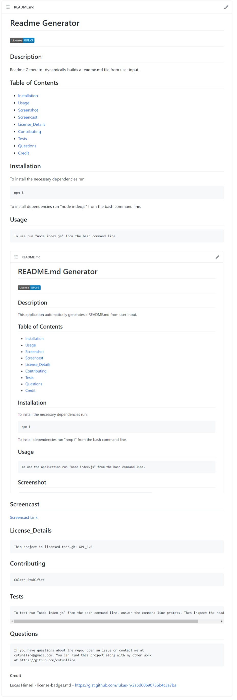

# README.md Generator
## [](https://www.gnu.org/licenses/gpl-3.0)
## Description 
This application automatically generates a README.md from user input.
## Table of Contents
- [Installation](#installation)
- [Usage](#usage)
- [Screenshot](#screenshot)
- [Screencast](#screencast)
- [License_Details](#license_details)
- [Contributing](#contributing) 
- [Tests](#tests)
- [Questions](#questions)
- [Credit](#Credit)
## Installation
To install the necessary dependencies run:
```
npm i
```
To install dependencies run "nmp i" from the bash command line.
## Usage
```
To use the application run "node index.js" from the bash command line.
```
## Screenshot

## Screencast
[Screencast Link](https://drive.google.com/file/d/1mhqe4WnObjpgtZxWwA_aonYFAieBGqPJ/view?usp=sharing)
## License_Details
```
This project is licensed through: GPL_3.0
```
## Contributing
```
Coleen Stuhlfire
```
## Tests
```
To test the application run "node index.js" from the bash command line. Answer the command line prompts. Then inspect the generated README.md file.
```
## Questions
```
If you have questions about the repo, open an issue or contact me at 
cstuhlfire@gmail.com. You can find this project along with my other work 
at https://github.com/cstuhlfire.
```
#### Credit
Lucas Himsel - license-badges.md - 
https://gist.github.com/lukas-h/2a5d00690736b4c3a7ba
